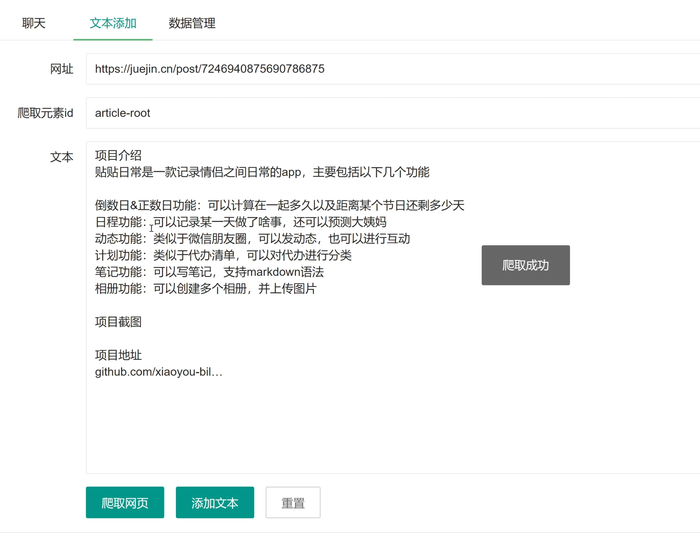
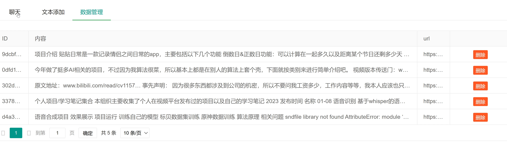
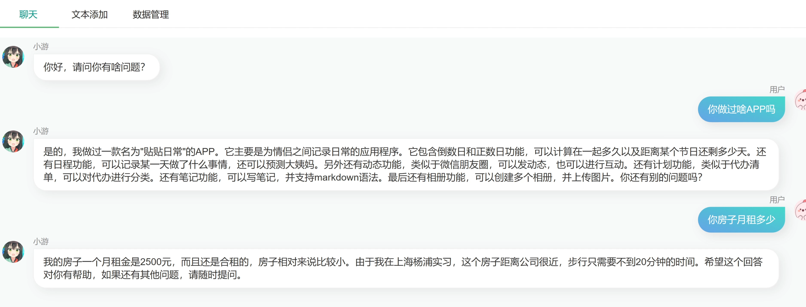
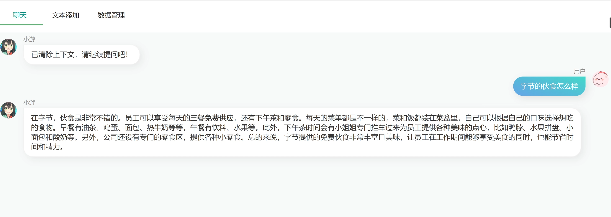

# 基于大语言模型的个人知识库

## 项目功能

- 基于embedding的文档搜索，每次只会只搜索最相关的文档，不会把所有的文档都喂给gpt
- 提供网页爬取和文本导入功能，可以导入自己想要的内容
- 提供数据管理界面，可以看到自己的数据，以及对数据删除的功能
- 提供聊天界面，支持保存上下文
- 支持日常聊天，文章总结，问题询问等功能

## 项目展示

网页爬取功能

知识内容管理

可以问一些文档里面的问题

还可以对文章进行总结

## 项目运行

先到 `base/config.py` 修改openapi的key信息，然后使用`pip install -r requirements.txt`安装一下依赖，最后使用`pyton main.py`就可以启动了
